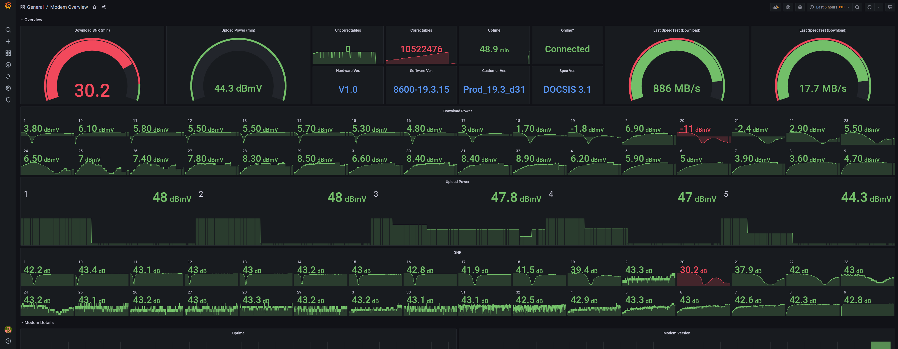

# MB8600

Somewhat of an all-in-one solution to monitoring your MB8600 and being able to script reboots.

Still somewhat of a WIP - but it's usable. Not sure how far I'll go with this project.





## WHY?
- I have this weird issue with my ISP where the download speed slows down to like 50-90% during the evenings. I also noticed a huge number of uncorrectables every time I see my modem's stats, so I wanted to be able to visualize it to see what was happening.
- I also had a curiosity if I could automate rebooting the modem.


## Requirements for Easy Install

Python3.8 (probably will work with 3.6+, but I'm only testing with 3.8+)
- `poetry`

## Steps to run basic script
```
git clone [this project]
cd mb8600
poetry install

# Modify test.py with the correct username password. Default is admin/password
poetry run python test.py
```

## Steps to run influxdb import
Assuming you ran the basic script already
```
poetry run python data_export.py --host [influxdbhost] --db modem-test
```

There are more parameters 
```
❯ poetry run python data_export.py --help
usage: data_export.py [-h] --host HOST [--port PORT] [--user USER] [--pw PW] [--db DB] [--fresh] [--sleep SLEEP] --mhost MHOST [--muser MUSER] [--mpw MPW]

optional arguments:
  -h, --help     show this help message and exit
  --host HOST    Host where influxdb is located.
  --port PORT    Port Number (default 8086)
  --user USER    InfluxDB Username
  --pw PW        InfluxDB Password
  --db DB        InfluxDB Database Name
  --fresh        Recreate the influx database.
  --sleep SLEEP  Time to sleep between data fetching. Recommended to be 30 or higher. (Most likely can't do less than 15)
  --mhost MHOST  Modem IP.
  --muser MUSER  InfluxDB Username
  --mpw MPW      InfluxDB Password
```

### Run influxdb report via docker

```
docker build -t influx-modem .
docker run -it -e INFLUX_HOST="192.168.1.100" influx-modem

# If you want to store the logs
docker run -it -e INFLUX_HOST="192.168.1.100" -v PATH_TO_LOGS_ON_HOST:/logs influx-modem 
```

### Rebooting the modem 
```
# If not using docker
poetry run python reboot.py

# If using docker, but it's not running
docker run -it influx-modem "poetry run python reboot.py"

# if using docker, and it's running.
docker exec -it [container] "poetry run python reboot.py"
```


## Observations
These are solely my observations - may not be actually true.

- You can't make more than 1 request at a time, the modem's webserver only serves 1 request at a time.
- I wouldn't suggest having any of this information exposed to the public network in any way unless you modify the script/library first. Mac Address is sensitive information and can have others attempt to steal your network provider.
- Because of how slow the modem is sometimes, you will get `requests.exceptions.ChunkedEncodingError - InvalidChunkLength` once in a while. This can be safely ignored. You *might* be able to reduce this occurrance if you increase `SLEEP_TIMER`


## Credits

HUGE THANKS to these projects for helping me understand how HNAP is working on this modem.
- https://github.com/aclytle/Motorola-Modem-Reboot
- https://github.com/uoodsq/moto-modem


Also including a dashboard that can be used alongside. I use this speedtest+influxdb project to get download/upload speeds in the dashboard
- https://github.com/breadlysm/SpeedFlux


Things you should modify after importing the dashboard
- For Speedtest, you will need to modify the thresholds to fit whatever is normal for your internet. Default is set to 600/15, which is what I use.
- Correctables/Incorrectables are set to thresholds of 1,000,000 - Should be OK, but do whatever is best for your situation.


## TODO

### Stuff I would like to add
- Maybe add a way to change credentials, probably not all that useful though. (requires re-implementing their AES128 Encryption in JS)

### Stuff that I don't use, but feel may be helpful for others
- Docker Compose file that contains influxdb, grafana, the influx exporter, and speedflux for an all-in-one solution.
- Small webserver with simple GET REST requests so people can just extend this with their own code easily.
